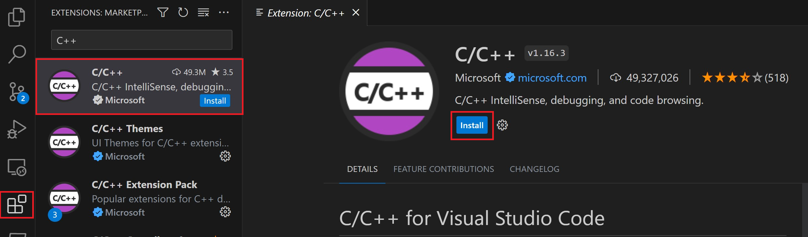

# Bài 2: Cài Đặt Môi Trường Phát Triển với Visual Studio Code trên Windows

Trong bài học này, mình sẽ hướng dẫn bạn cách cài đặt và thiết lập Visual Studio Code (VS Code) trên Windows để chuẩn bị cho việc lập trình C++. 

VS Code là một công cụ rất phổ biến, nhẹ, và dễ sử dụng – chắc chắn sẽ là người bạn đồng hành tốt của chúng ta!

## I. Tại sao nên dùng Visual Studio Code?
VS Code là một trình soạn thảo mã nguồn mở, hoàn toàn miễn phí, và được phát triển bởi Microsoft. Điểm mạnh của VS Code là:

- **Gọn nhẹ**: Không nặng máy, khởi động nhanh.
- **Nhiều tiện ích mở rộng**: Bạn có thể cài đặt các tiện ích để hỗ trợ lập trình C++, Python, và nhiều ngôn ngữ khác.
- **Hỗ trợ đa nền tảng**: Chạy tốt trên Windows, macOS, và Linux.

## II. Tải và cài đặt VS Code
- Truy cập vào trang web của VS Code: [https://code.visualstudio.com/](https://code.visualstudio.com/)
- Nhấn vào nút **Download for Windows** và chờ tải về.
- Sau khi tải xong, bạn mở file cài đặt (.exe) và làm theo các bước hướng dẫn để hoàn tất.

## III. Cài đặt tiện ích C/C++ cho VS Code
- Mở VS Code lên, bạn sẽ thấy một biểu tượng hình ô vuông có 4 dấu chấm nhỏ ở bên trái, đây là **Extensions** (tiện ích mở rộng).
- Nhấn vào đó và tìm “C/C++” của Microsoft. Chọn **Install** để cài đặt tiện ích này. Đây là công cụ cần thiết để VS Code có thể hiểu và làm việc với mã C++ của bạn.



## IV. Cài Đặt Bộ Công Cụ MinGW-w64 Qua MSYS2
Dưới đây là hướng dẫn chi tiết để cài đặt MinGW-w64 thông qua MSYS2 trên Windows. Bạn sẽ có một bộ công cụ đầy đủ để biên dịch, gỡ lỗi và sử dụng IntelliSense trong Visual Studio Code.

### 1. Tải và cài đặt MSYS2
- Tải bản cài đặt mới nhất tại [https://www.msys2.org/](https://www.msys2.org/) hoặc dùng liên kết trực tiếp: [MSYS2 Installer](https://github.com/msys2/msys2-installer/releases/download/2024-01-13/msys2-x86_64-20240113.exe).
- Chạy file cài đặt và làm theo hướng dẫn. Lưu ý rằng MSYS2 yêu cầu Windows 8.1 64-bit hoặc mới hơn.
- Trong quá trình cài đặt, chọn thư mục cài đặt mong muốn (thường là mặc định).
- Khi hoàn tất, hãy đánh dấu vào ô **Run MSYS2 now** (Chạy MSYS2 ngay bây giờ) và nhấn **Finish** để mở cửa sổ terminal MSYS2.

### 2. Cài đặt công cụ MinGW-w64
- Trong cửa sổ MSYS2 terminal, chạy lệnh sau để cài đặt bộ công cụ MinGW-w64:
```bash
pacman -S --needed base-devel mingw-w64-ucrt-x86_64-toolchain
```
- Nhấn Enter để chấp nhận các gói mặc định. Khi được hỏi **"Proceed with installation?"**, nhập **Y** và nhấn Enter.

### 3. Thêm MinGW-w64 vào biến PATH của Windows
- Mở **Settings** (Cài đặt) trong Windows, sau đó tìm **Edit environment variables for your account** (Chỉnh sửa biến môi trường cho tài khoản của bạn).
- Trong phần **User variables**, chọn **Path** rồi nhấn **Edit**.
- Nhấn **New** và thêm đường dẫn tới thư mục **bin** của MinGW-w64. Nếu bạn dùng cài đặt mặc định, đường dẫn sẽ là:
   ```plaintext
   C:\msys64\ucrt64\bin
   ```
- Nhấn **OK** và sau đó **OK** một lần nữa để lưu thay đổi. Đóng và mở lại bất kỳ cửa sổ Command Prompt nào để cập nhật biến PATH.

### 4. Kiểm tra cài đặt MinGW-w64
- Mở một cửa sổ Command Prompt mới và nhập các lệnh sau để kiểm tra:
   ```bash
   gcc --version
   g++ --version
   gdb --version
   ```
- Nếu thấy hiển thị phiên bản của **gcc**, **g++**, và **gdb**, thì quá trình cài đặt đã thành công!

Nếu không thấy thông tin phiên bản hoặc có lỗi:
   - Kiểm tra lại biến **PATH** để đảm bảo đường dẫn đến thư mục **bin** của MinGW-w64 đã được thêm chính xác.
   - Đảm bảo đã cài đặt đầy đủ các gói cần thiết thông qua MSYS2.

Vậy là bạn đã hoàn tất cài đặt MinGW-w64! Bây giờ bạn có thể sẵn sàng viết và chạy các chương trình C++ trong VS Code. Trong bài học tiếp theo, mình sẽ hướng dẫn bạn viết chương trình "Hello, World!" đầu tiên để kiểm tra xem mọi thứ có hoạt động ổn không nhé!

## V. Thiết lập VS Code để chạy C++
- Mở VS Code và tạo một file mới với đuôi `.cpp`, ví dụ: `helloworld.cpp`.
- Nhấn **Ctrl + Shift + P** để mở Command Palette, gõ **Run Build Task** và chọn `g++` để biên dịch.
- Nếu bạn thấy file `.exe` xuất hiện và chạy thành công, nghĩa là bạn đã hoàn tất các bước cài đặt!

---

Thế là xong! Bây giờ, bạn đã sẵn sàng để viết chương trình C++ đầu tiên của mình rồi đấy. Trong bài học tiếp theo, chúng ta sẽ cùng nhau viết và chạy chương trình “Hello, World!” để kiểm tra xem mọi thứ có hoạt động ổn không nhé!